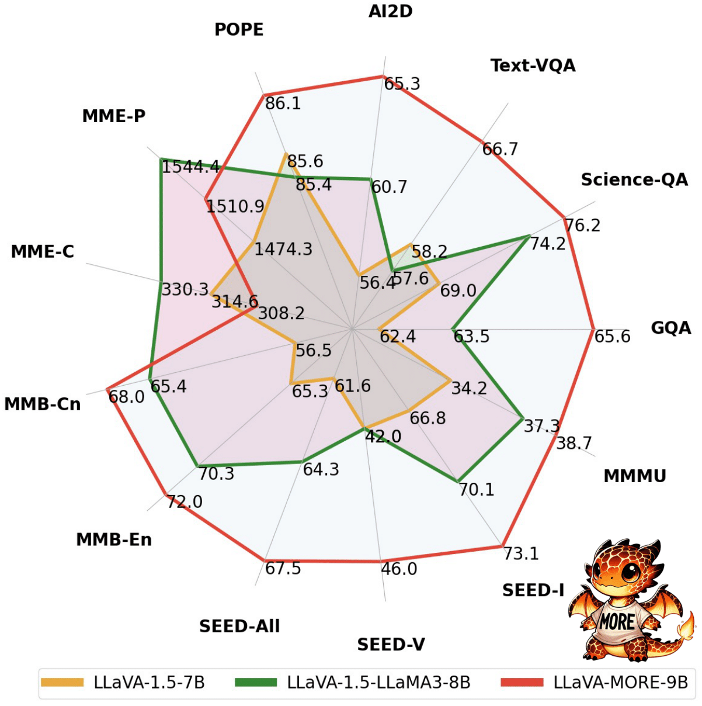

<div align="center">
  
  <h1>  🔥 LLaVA-MORE 🔥
    
 A Comparative Study of LLMs and Visual Backbones <br>for Enhanced Visual Instruction Tuning
  </h1>  

[](https://huggingface.co/collections/aimagelab/llava-more-66aa6c49167e190bf27e7be4)
[](https://arxiv.org/abs/2503.15621)
[](https://aimagelab.ing.unimore.it/imagelab)

</div>


<div align='center'>

#### [Federico Cocchi](https://federico1-creator.github.io/Federico_Cocchi/), [Nicholas Moratelli](https://nicholasmoratelli.github.io), [Davide Caffagni](https://github.com/dcaffo98), [Sara Sarto](https://github.com/sarasarto),
#### [Lorenzo Baraldi](https://www.lorenzobaraldi.com/), [Marcella Cornia](https://aimagelab.ing.unimore.it/imagelab/person.asp?idpersona=90) and [Rita Cucchiara](https://aimagelab.ing.unimore.it/imagelab/person.asp?idpersona=1)

</div>

## Citation
If you make use of our work, please cite our paper:

```bibtex
@inproceedings{cocchi2025llava,
      title={{LLaVA-MORE: A Comparative Study of LLMs and Visual Backbones for Enhanced Visual Instruction Tuning}},
      author={Cocchi, Federico and Moratelli, Nicholas and Caffagni, Davide and Sarto, Sara and Baraldi, Lorenzo and Cornia, Marcella and Cucchiara, Rita},
      booktitle={Proceedings of the IEEE/CVF International Conference on Computer Vision Workshops},
      year={2025}
}
```


## 📢 Latest Updates
- [2025/07/22] 📚 LLaVA-MORE has been accepted at "What is Next in Multimodal Foundation Models? " @ ICCV Workshop 2025
- [2025/05/22] Check out [our latest paper](https://arxiv.org/pdf/2503.15621)
- [2025/03/18] 🔥 LLaVA-MORE 8B is now availalbe on [Ollama](https://ollama.com/aimagelab/llava-more-8b)!
- [2024/08/16] 📌 Improved LLaVA-MORE 8B model, considering advanced image backbones.
- [2024/08/01] 🔥 First release of our LLaVA-MORE 8B, based on LLaMA 3.1.
- [2024/08/01] 🔎 If you are interested in this area of research, check out [our survey](https://arxiv.org/abs/2402.12451) on the revolution of Multimodal LLMs, recently published in ACL (Findings).
- [2024/08/01] 📚 Check out the latest researches from [AImageLab](https://aimagelab.ing.unimore.it/imagelab/).
<!-- - [2025/03/21] 🔜 Training and release of our LLaVA-MORE checkpoints with different LLMs and Visual Backbones -->

## Table of Contents

1. [Overview](#overview)
2. [Performance](#performance)
3. [Checkpoints](#checkpoints)
4. [Installation](#installation)
5. [Training](#training)
6. [Inference](#inference)
7. [Acknowledgments](#acknowledgments)

## Overview

```LLaVA-MORE``` is a new family of MLLMs that integrates recent language models with diverse visual backbones. To ensure fair comparisons, we employ a unified training protocol applied consistently across all architectures.
To further support the research community in enhancing MLLMs performance, we are also releasing the training code and scripts for distributed training.

Remember to star the repository to stay updated on future releases 🤗!

## Performance
In this section, we present the performance of our model compared to other versions of LLaVA across different multimodal datasets.

<div align="center">

</div>

### Benchmarks and Comparisons on Instruction Multimodal Datasets in the Literature

<div align="center">

|       Model Name     |  Text-VQA*  |  Science-QA  |  AI2D  |  SEED-vid  |  SEED-all  |  SEED-img  |  MMMU  |  MMBench-Cn  |  MMBench-En  |  POPE  |  GQA  |   MME-P  |  MME-C  |
|----------------------|:----------: |:------------:|:------:|:----------:|:----------:|:----------:|:------:|:------------:|:------------:|:------:|:-----:|:--------:|:-------:|
|    LLaVA-v1.5-7B                       |    58.2      |     69.0     |  56.4     |    42.0    |    61.6    |    66.8     |  34.2     |      56.5     |      65.3     |  85.6     |  62.4     |  1474.3     |  314.6     |
| LLaVA-v1.5-LLaMA3-8B                   |    57.6      |     74.2     |  60.7     |    42.0    |    64.3    |    70.1     |  37.3     |      65.4     |      70.3     |  85.4     |  63.5     |  1544.4     |  330.3     |
|  **LLaVA-v1.5-LLaMA3_1-8B**            |    58.4      |     76.3     |  61.8     |    42.4    |    64.1    |    69.8     |  39.4     |      **68.2** |      72.4     |  85.1     |  63.6     |  1531.5     |  **353.3** |
|  **LLaVA-v1.5-LLaMA3_1-8B-S2**         |    60.9      |     76.7     |  62.2     |    42.3    |    64.2    |    69.9     |  38.7     |      65.8     |      71.1     |  86.5     |  64.5     |  **1563.8** |  293.2     |
|  **LLaVA-v1.5-LLaMA3_1-8B-siglip**     |    62.1      |     **77.5** |  63.6     |  **46.1**  |    65.8    |    71.0     |  39.8     |      **68.2** |      **73.1** |  86.1     |  64.6     |  1531.0     |  315.4     |
|  **LLaVA-v1.5-LLaMA3_1-8B-S2-siglip**  |    63.5      |     77.1     |  62.7     |    44.7    |    65.5    |    71.0     |  **40.0** |      68.0     |      71.8     |  86.0     |  64.9     |  1541.4     |  336.4     |
|  **LLaVA-v1.5-Phi_4-4B**               |    54.0      |     71.3     |  61.1     |    42.3    |    63.5    |    69.1     |  38.8     |      64.2     |      69.2     |  85.9     |  62.1     |  1372.2     |  281.1     |
|  **LLaVA-v1.5-gemma_2-9B**             |    60.7      |     75.4     |  64.8     |    44.1    |    64.5    |    69.9     |  37.9     |      65.9     |      71.9     |  **86.8** |  64.2     |  1522.5     |  307.5     |
|  **LLaVA-v1.5-gemma_2-9B-siglip2**     |    **66.7**  |     76.2     |  **65.3** |    46.0    |   **67.5** |    **73.1** |  38.7     |      68.0     |      72.0     |  86.1     |  **65.6** |  1510.9     |  308.2     |
|  **LLaVA-v1.5-Distill-LLaMA-8B**       |    56.3      |     74.5     |  58.8     |    43.5    |    63.5    |    68.6     |  38.1     |      66.8     |      61.3     |  85.1     |  63.0     |  1495.1     |  295.0     |


</div>

*\* The results of TextVQA are computed with OCR token in the input prompt.* **The models in bold represent LLaVA-MORE variants.**

## Checkpoints

In the table below, you can find links to ours 🤗 Hugging Face models.

|         Model Name        |      🤗 Hugging Face      |             Summary                            |
|---------------------------|:-------------------------:|------------------------------------------------|
| LLaVA_MORE-llama_3_1-8B-pretrain | [Hugging Face Model](https://huggingface.co/aimagelab/LLaVA_MORE-llama_3_1-8B-pretrain)  | Pretrained on [LCS-558K](https://huggingface.co/datasets/liuhaotian/LLaVA-Pretrain) and using [LLaMA 3.1 8B Instruct](https://huggingface.co/meta-llama/Meta-Llama-3.1-8B-Instruct) as LLM backbone            |
| LLaVA_MORE-llama_3_1-8B-finetuning | [Hugging Face Model](https://huggingface.co/aimagelab/LLaVA_MORE-llama_3_1-8B-finetuning)  | Finetuned on [LLaVA-Instruct-665K](https://huggingface.co/datasets/liuhaotian/LLaVA-Instruct-150K) and using [LLaMA 3.1 8B Instruct](https://huggingface.co/meta-llama/Meta-Llama-3.1-8B-Instruct) as LLM backbone         |
| LLaVA_MORE-llama_3_1-8B-S2-pretrain | [Hugging Face Model](https://huggingface.co/aimagelab/LLaVA_MORE-llama_3_1-8B-S2-pretrain)  | Pretrained on [LCS-558K](https://huggingface.co/datasets/liuhaotian/LLaVA-Pretrain) and using [LLaMA 3.1 8B Instruct](https://huggingface.co/meta-llama/Meta-Llama-3.1-8B-Instruct) as LLM backbone            |
| LLaVA_MORE-llama_3_1-8B-S2-finetuning | [Hugging Face Model](https://huggingface.co/aimagelab/LLaVA_MORE-llama_3_1-8B-S2-finetuning)  | Finetuned on [LLaVA-Instruct-665K](https://huggingface.co/datasets/liuhaotian/LLaVA-Instruct-150K) and using [LLaMA 3.1 8B Instruct](https://huggingface.co/meta-llama/Meta-Llama-3.1-8B-Instruct) as LLM backbone         |
| LLaVA_MORE-llama_3_1-8B-siglip-pretrain | [Hugging Face Model](https://huggingface.co/aimagelab/LLaVA_MORE-llama_3_1-8B-siglip-pretrain)  | Pretrained on [LCS-558K](https://huggingface.co/datasets/liuhaotian/LLaVA-Pretrain) and using [LLaMA 3.1 8B Instruct](https://huggingface.co/meta-llama/Meta-Llama-3.1-8B-Instruct) as LLM backbone            |
| LLaVA_MORE-llama_3_1-8B-siglip-finetuning | [Hugging Face Model](https://huggingface.co/aimagelab/LLaVA_MORE-llama_3_1-8B-siglip-finetuning)  | Finetuned on [LLaVA-Instruct-665K](https://huggingface.co/datasets/liuhaotian/LLaVA-Instruct-150K) and using [LLaMA 3.1 8B Instruct](https://huggingface.co/meta-llama/Meta-Llama-3.1-8B-Instruct) as LLM backbone         |
| LLaVA_MORE-llama_3_1-8B-S2-siglip-pretrain | [Hugging Face Model](https://huggingface.co/aimagelab/LLaVA_MORE-llama_3_1-8B-S2-siglip-pretrain)  | Pretrained on [LCS-558K](https://huggingface.co/datasets/liuhaotian/LLaVA-Pretrain) and using [LLaMA 3.1 8B Instruct](https://huggingface.co/meta-llama/Meta-Llama-3.1-8B-Instruct) as LLM backbone            |
| LLaVA_MORE-llama_3_1-8B-S2-siglip-finetuning | [Hugging Face Model](https://huggingface.co/aimagelab/LLaVA_MORE-llama_3_1-8B-S2-siglip-finetuning)  | Finetuned on [LLaVA-Instruct-665K](https://huggingface.co/datasets/liuhaotian/LLaVA-Instruct-150K) and using [LLaMA 3.1 8B Instruct](https://huggingface.co/meta-llama/Meta-Llama-3.1-8B-Instruct) as LLM backbone         |
| LLaVA_MORE-phi_4-finetuning | [Hugging Face Model](https://huggingface.co/aimagelab/LLaVA_MORE-phi_4-finetuning)  | Finetuned on [LLaVA-Instruct-665K](https://huggingface.co/datasets/liuhaotian/LLaVA-Instruct-150K) and using [Phi 4 Instruct](https://huggingface.co/microsoft/Phi-4-mini-instruct) as LLM backbone         |
| LLaVA_MORE-gemma_2_9b-finetuning | [Hugging Face Model](https://huggingface.co/aimagelab/LLaVA_MORE-gemma_2_9b-finetuning)  | Finetuned on [LLaVA-Instruct-665K](https://huggingface.co/datasets/liuhaotian/LLaVA-Instruct-150K) and using [gemma 2 9B Instruct](https://huggingface.co/google/gemma-2-9b-it) as LLM backbone         |
| LLaVA_MORE-gemma_2_9b-siglip2-finetuning | [Hugging Face Model](https://huggingface.co/aimagelab/LLaVA_MORE-gemma_2_9b-siglip2-finetuning)  | Finetuned on [LLaVA-Instruct-665K](https://huggingface.co/datasets/liuhaotian/LLaVA-Instruct-150K) and using [gemma 2 9B Instruct](https://huggingface.co/google/gemma-2-9b-it) as LLM backbone and [SigLIP2](https://huggingface.co/google/siglip2-so400m-patch14-384) as visual backbone         |
| LLaVA_MORE-llama_3_1-reasoning-finetuning | [Hugging Face Model](https://huggingface.co/aimagelab/LLaVA_MORE-llama_3_1-reasoning-finetuning)  | Finetuned on [LLaVA-Instruct-665K](https://huggingface.co/datasets/liuhaotian/LLaVA-Instruct-150K) and using [DeepSeek-R1-Distill-Llama-8B](https://huggingface.co/deepseek-ai/DeepSeek-R1-Distill-Llama-8B) as LLM backbone         |


## Installation
To create the conda environment named ```more``` use the following instructions.
With this environment you will have all the packages to run the code (training and evaluation) in this repo. 
```
conda create -n more python==3.8.16
conda activate more
pip install -r requirements.txt
```

Note that the requirements are heavily inspired by the original [LLaVA](https://github.com/haotian-liu/LLaVA.git) repo.

## Training
To help the community in training complex systems in distributed scenarios, we are publicly releasing not only the source code but also the bash scripts needed to train ```LLaVA-MORE``` on HPC facilities with a SLURM scheduler.

To further extend the reproducibility of our approach, we are also releasing the [wandb logs](https://api.wandb.ai/links/aimagelab/kq668y5l) of the training runs.

**Pretraining**

``` bash
cd ~/LLaVA-MORE
sbatch scripts/llava-more/release_1/11_pretrain_llama_31_acc_st_1.sh
```
**Finetuning**
``` bash
cd ~/LLaVA-MORE
sbatch scripts/llava-more/release_1/12_finetuning_llama_31_acc_st_1.sh
```

<!-- ### Visual Backbones

As mentioned before, ```LLaVA-MORE``` introduces the use of LLaMA 3.1 within the LLaVA architecture for the first time. However, this repository goes beyond that single enhancement.
We have also incorporated the ability to use different visual backbones, such as SigLIP, and various methods for managing image resolutions (S2).

Considering that, you can view this repo as an effort to expand the study of Multimodal LLMs in multiple directions and as a 
starting point for enhancing new features to improve the connection between images and language.

You can find more references in this folder: ```scripts/more```. -->

## Evaluation
To reproduce the evaluation protocol, please follow the instructions below.

``` bash
cd ~/LLaVA-MORE
sbatch scripts/llava-more/eval/lmms_eval_single_task.sh
```

## Inference
You can try to ask multimodal question to ```LLaVA-MORE``` using the following script.
``` python
source activate more
cd ~/LLaVA-MORE
export PYTHONPATH=.

# tokenizer_model_path
model_path=aimagelab/LLaVA_MORE-llama_3_1-8B-finetuning
model_architecture=llama_3_1
conversation=llama_3_1

export HF_TOKEN=hf_read_token
export TOKENIZER_PATH=$model_path

python -u src/llava/eval/run_llava.py --model-path $model_path --model-architecture $model_architecture --conv-mode $conversation
```
If you get out-of-memory problems, consider loading the model weights in 8 bit (```load_in_8bit=True```).

## Acknowledgments
We thank the [LLaVA](https://github.com/haotian-liu/LLaVA.git) team for open-sourcing a modular codebase to extend and train different models within the LLaVA family.
We are also happy users of the [lmms-eval](https://github.com/EvolvingLMMs-Lab/lmms-eval.git) library, which has significantly reduced the evaluation time of our checkpoints across different datasets.

We also thank [CINECA](https://www.hpc.cineca.it/systems/hardware/leonardo/) for the availability of high-performance computing resources used to train ```LLaVA-MORE```. This work is supported by the PNRR-M4C2 project [FAIR - Future Artificial Intelligence Research](https://fondazione-fair.it/) and by the PNRR project [ITSERR - Italian Strengthening of Esfri RI Resilience](https://www.itserr.it/).


In case you face any issues or have any questions, please feel free to create an issue.
Additionally, we welcome you to open a pull request to integrate new features and contribute to our project.
